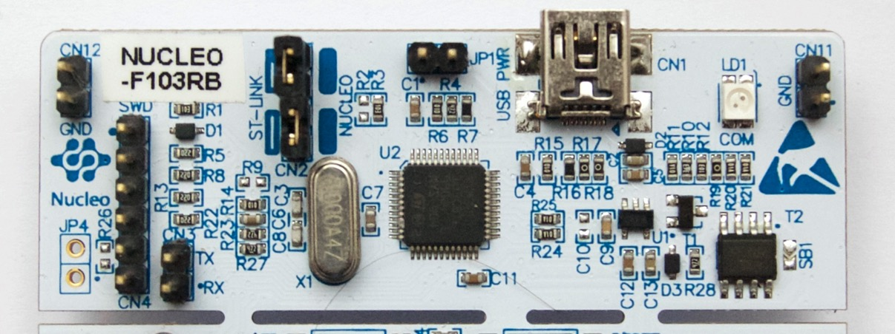

# Flasher du code

## 1. Utiliser le STLINK
Pour flasher du code sur un STM32 (Blackpill ou Nucleo), il faut tout d'abord t'assurer qu'un STLINK est correctement relié à la carte.
Qu'est ce qu'un STLINK ? C'est ça : 

- **Branchement sur la BlackPill**

Il te suffit de suivre les branchements présentés sur le schéma ci-dessous et tout devrait bien se passer :

**[Insérer Beau schéma ici]**

- **Branchement sur une Nucleo**

Si le STLINK n'a pas été scié de la carte, il n'y a rien à faire, tu peux directement passer à létape suivante ! 
Sinon, il te faut suivre les branchements présentés sur le schéma ci-dessous :

**[Insérer Beau schéma ici]**